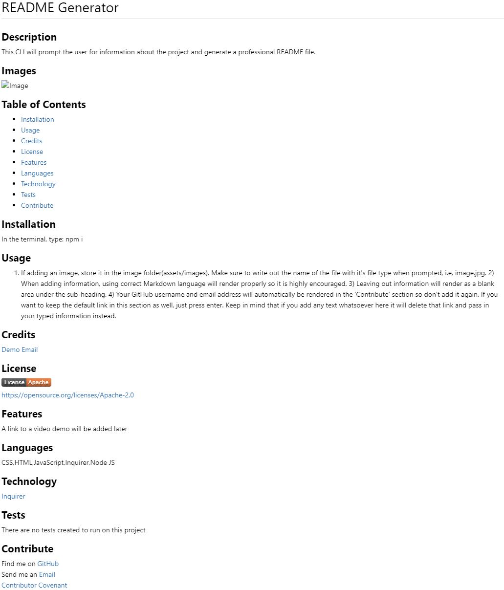

  # README Generator

  ## **Description**
  This CLI will prompt the user for information about the project and generate a professional README file

  ## **Images**
  
  
  ## **Table of Contents**
  
  * [Installation](#dependencies)
  * [Usage](#usage)
  * [Credits](#credits)
  * [License](#license)
  * [Features](#features)
  * [Languages](#languages)
  * [Technology](#technology)
  * [Tests](#tests)
  * [Contribute](#contribute)
  
  ## **Installation**
  In the terminal, type: npm i

  ## **Usage**
  1) If adding an image, store it in the image folder(assets/images). Make sure to write out the name of the file with it's file type when prompted, i.e, image.jpg. 2) When adding information, using correct Markdown language will render properly so it is highly encouraged. 3) Leaving out information will render as a blank area under the sub-heading. 4) Your GitHub username and email address will automatically be rendered in the 'Contribute' section so don't add it again. If you want to keep the default link in this section as well, just press enter. Keep in mind that if you add any text whatsoever here it will delete that link and pass in your typed information instead.

  ## **Credits**
  

  ## **License**
  
   
  
   

  ## **Features**
  [Demo Video](https://drive.google.com/file/d/153XDhCs8-_psQP4W_oevHuNSxC1-nmUP/view)

  ## **Languages**
  JavaScript,Inquirer,Node JS

  ## **Technology**
  [Inquirer](https://www.npmjs.com/package/inquirer)   [Node JS](https://nodejs.org/en/)   [JavaScript](https://developer.mozilla.org/en-US/docs/Web/javascript)

  ## **Tests**
  There are no tests for this yet

  ## **Contribute**
  Find me on [GitHub](https://www.github.com/mattbisbee)
   
  Send me an [Email](mailto:aldhelm7@gmail.com)
   
  [Contributor Covenant](https://www.contributor-covenant.org/)
